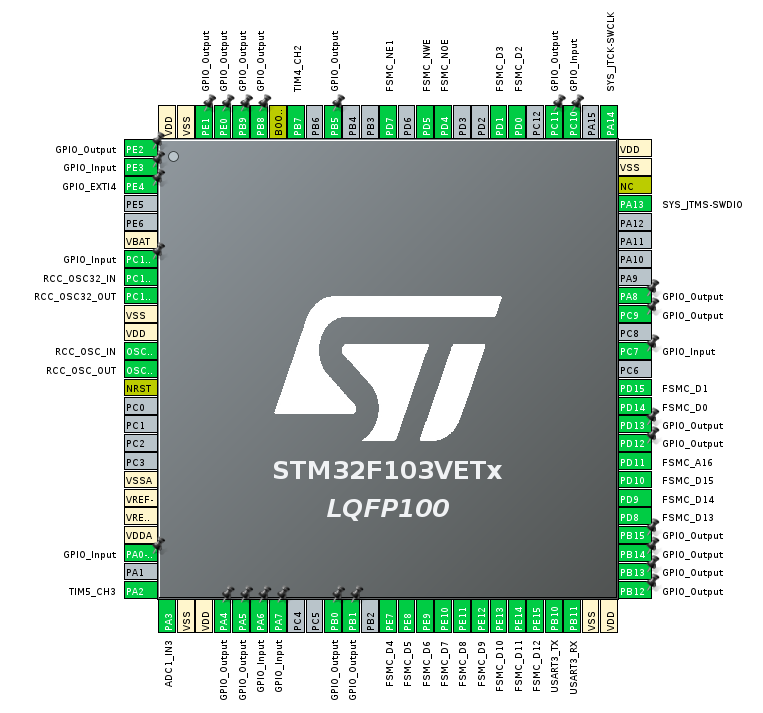

# Mini Robot Cleaner
Final course project for ELEC3300 (Introduction to Embedded Systems) in HKUST where we created a Mini-Robot Cleaner with STM32 as the MCU. The robot has 2 modes which are manual mode where the user can control the robot wirelessly through UDP transmissions (via Python script) and also a automatic mode where the robot card will move freely and avoid obstacles.

Here is a demo video: [Youtube Link](https://youtu.be/z4BqyFa29B0)

## Functions:
- STM32 connected with LCD Display through FSMC, uses LVGL library for GUI, driver function uses DMA to improve performance of display
-  The GUI menu shows robot information, allows user to choose between manual and automatic mode through touch screen, and also has section to print debugging information such as sensor readings.
- STM32 communicates with ESP8266 through UART and is able to host a TCP server and also listen to UDP transmissions with AT commands sent from STM32 through UART
- Python script for sending robot controls through UDP tranmission. Used PyQt5 for creating a GUI on PC
- Uses ultrasonic sensor (HR-S04) data to make decision to avoid obstacle when in automatic mode
- Reads temperature sensor from LM35 with ADC conversion, user remotely request and view the sensor data with Python GUI where data is sent through UDP

## Other Info:
- Main Board: 野火 STM32F103VET6 Mini V3 Development Board ([Schematics](./resources/MINIV3-Schematic.pdf))

- Development Platform for STM32: CubeIDE

- Connections:

- STM32 connects to LCD through FSMC, communicates to ESP8266 through UART, connects to motor and ultrasonic sensors through GPIO, LM35 with ADC.