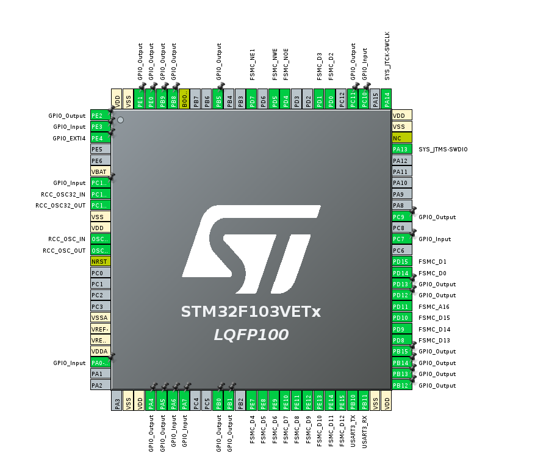

# ELEC3300 Project
Ongoing ELEC3300 course project for a robot car cleaner. The robot has 2 modes which are manual mode where the user can control the robot wirelessly through a UDP transmissions and also a automatic mode where the robot card will move freely and avoid obstacles.

## Done so far:
- Got LCD Display working with LVGL, also used DMA to improve performance of touch screen
- Created simple touch screen menu with LVGL library, shows robot information and also allows user to choose between manual and automatic mode through touch screen
- Got ESP8266 working and able to host a TCP server and also listen to UDP transmissions with AT commands sent from STM32 through UART
- Created a python script for sending robot direction controls through UDP tranmission.
- Able to read ultrasonic sensor data and make decision based on data to avoid obstacle with simple wall-follower right hand rule solution

Quick demo of our progress on interim demo day: 

# Todo:
- Add motor cleaner to robot car
- Add speed control
- Improve obstacle avoidance alogrithm by using 3 ultrasonic sensors and making decision from those 3 sensor readings to find optimal path
- Potentially add other sensors and peripherals such as camera

## Overview:
- Connections:

STM32 connects to LCD through FSMC, communicates to ESP8266 through UART, connects to motor and ultrasonic sensors through GPIO.