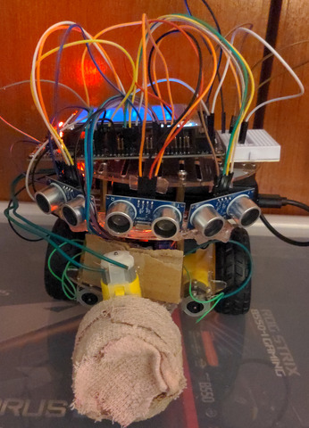
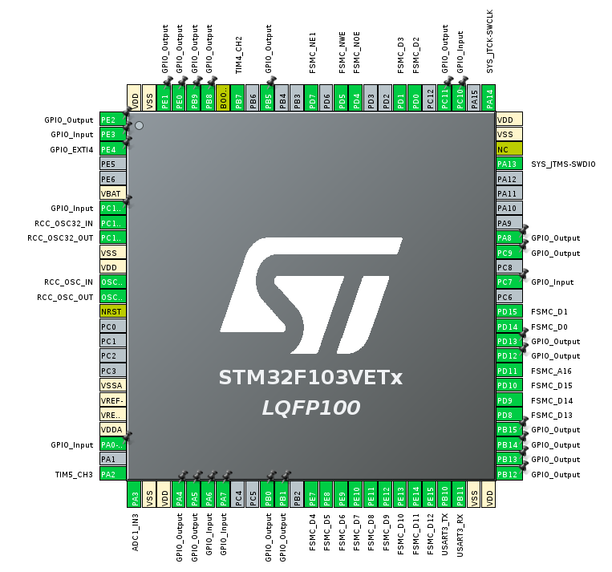

# Mini Robot Cleaner
Final course project for ELEC3300 (Introduction to Embedded Systems) in HKUST where we created a Mini-Robot Cleaner with STM32 as the MCU. The robot has 2 modes which are manual mode where the user can control the robot wirelessly through UDP transmissions (via Python script) and also a automatic mode where the robot card will move freely and avoid obstacles using the "bubble rebound algorithm" described by [this paper]((https://www.researchgate.net/publication/228955195_Simple_real-time_obstacle_avoidance_algorithm_for_mobile_robots)). Robot car can also send temperature sensor data to a UDP server.

Here is a demo video: [Youtube Link](https://youtu.be/z4BqyFa29B0)

Project Presentation: [Link](./resources/ProjectPresentation.pdf)

## Features:
-  LCD Display with GUI. GUI menu shows robot information, allows user to choose between manual and automatic mode through touch screen, and also has section to print debugging information such as sensor readings.
- STM32 connected with LCD Display through FSMC, uses LVGL library for GUI, driver function uses DMA to improve performance of display
- STM32 communicates with ESP8266 through UART to connect to Wi-fi, create UDP server, and send UDP transmissions with AT commands
- GUI for sending robot controls through UDP tranmission. Written in Python and used PyQt5 for creating a GUI on PC
- Uses three ultrasonic sensor (HR-S04) data covering 90 degrees FOV to make decision to avoid obstacle when in automatic mode
- Reads temperature sensor from LM35 with ADC conversion, user remotely request and view the sensor data with Python GUI where data is sent through UDP to a UDP server

## Hardware Parts:
- [STM32F103VET6 Mini V3 Development Board](./resources/MINIV3-Schematic.pdf)
- ESP8266 (Built-in with Mini V3 board)
- [LM35 Temperature Sensor](https://www.ti.com/lit/ds/symlink/lm35.pdf)
- [HR-S04 Ultra-sonic sensor](https://web.eece.maine.edu/~zhu/book/lab/HC-SR04%20User%20Manual.pdf)
- [ILI9341 TFT LCD Display](https://cdn-shop.adafruit.com/datasheets/ILI9341.pdf)
- [L298N Motor Driver](https://asset.conrad.com/media10/add/160267/c1/-/en/001525437ML01/manual-1525437-iduino-st-1112-motor-controller-1-pcs.pdf)
- [DC Gear TT Motor](https://media.digikey.com/pdf/Data%20Sheets/Adafruit%20PDFs/3777_Web.pdf)

## Software/Other Resources:
- [LVGL Embedded Graphics Library](https://docs.lvgl.io/master/index.html)
- [ESP8266 AT Commands](https://docs.espressif.com/projects/esp-at/en/release-v2.2.0.0_esp8266/Get_Started/What_is_ESP-AT.html)
- [Bubble Rebound Alogrithm Used](https://www.researchgate.net/publication/228955195_Simple_real-time_obstacle_avoidance_algorithm_for_mobile_robots)

## Other Info:
- Main Board: 野火 STM32F103VET6 Mini V3 Development Board

- Development Platform for STM32: CubeIDE

- Connections:

- STM32 connects to LCD through FSMC for display and touch screen, communicates to ESP8266 through UART, connects to motor driver and ultrasonic sensors through GPIO, LM35 with ADC.

## Repo Folder Structure
- [Project](./Project/) contains the main project code that was used in CubeIDE 
- [udp_server](./udp_server/) contains the Python scripts for creating UDP server to receive robot data and also the GUI for controlling the robot
- [cubemx_workspace](./cubemx_workspace/) is my CubeIDE workspace folder, not needed
- [website_files](./website_files/) contains some html files that we tested when hosting a TCP server instead

## Full List Documentation/Schematics Used:
- [STM32F103VET6 Mini V3 Development Board Schematics](./resources/MINIV3-Schematic.pdf)
- [LM35 Temperature Sensor Documentation](https://www.ti.com/lit/ds/symlink/lm35.pdf)
- [HR-S04 Ultra-sonic sensor Documentation](https://web.eece.maine.edu/~zhu/book/lab/HC-SR04%20User%20Manual.pdf)
- [ILI9341 TFT LCD Display Documentation](https://cdn-shop.adafruit.com/datasheets/ILI9341.pdf)
- [LVGL Embedded Graphics Library Documentation](https://docs.lvgl.io/master/index.html)
- [ESP8266 AT Commands Documentation](https://docs.espressif.com/projects/esp-at/en/release-v2.2.0.0_esp8266/Get_Started/What_is_ESP-AT.html)
- [L298N Motor Driver Documentation](https://asset.conrad.com/media10/add/160267/c1/-/en/001525437ML01/manual-1525437-iduino-st-1112-motor-controller-1-pcs.pdf)
- [DC Gear TT Motor Documentation](https://media.digikey.com/pdf/Data%20Sheets/Adafruit%20PDFs/3777_Web.pdf)
- [Simple, real-time obstacle avoidance algorithm for mobile robots](https://www.researchgate.net/publication/228955195_Simple_real-time_obstacle_avoidance_algorithm_for_mobile_robots)